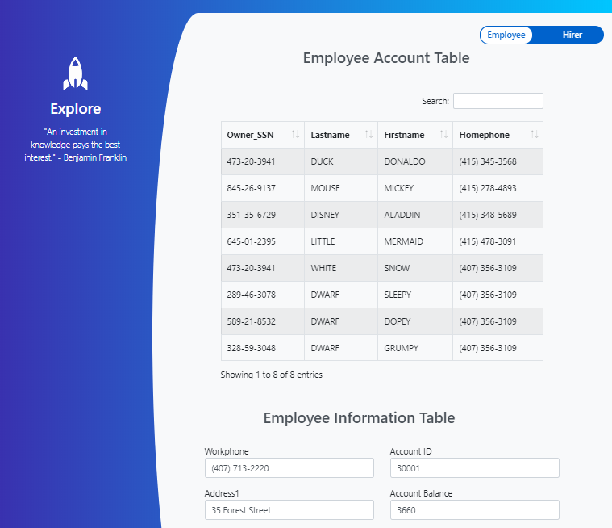

# MasterDetailTemplateV1
A simple  MasterDetail HTML Template that helps in designing Responsive Panther Web screen with AJAX and JQuery calls. Below is the screenshot of the completed MasterDetail screen in the Brower.
Latest Bootstrap libraries were used to transform the plan screen into a modern, responsive screen. It includes AJAX and JQuery calls to fetch the data by on click function on Bootstrap Datatable. 

# Prerequisites
Panther Web 5.5*

# This repository consists of 5 files
* Panther screen with name master_detail
* master_detail.html
* master_detail.css
* master_detail.js
* master_detail.jpl

# Master_Detail screen
Panther master_detail screen contains Panther grid and single line text filelds.  

# master_detail.html
HTML template is attached to the Panther Login screen via property WEB OPTION->HTML OPTIONs->HTML Template .

# master_detail.css
Cascading Style Sheets(CSS) file contains requirements like classes and ids provided to HTML tags.

# master_detail.js
Javascript file contains requirements like the message alerts, hidden button clicks, AJAX call to populate data in single line text field by on click function on rows of first column in datatable etc.

Jpl file contains code for the validation of user on login screen.  

Need a Panther Web 552 Redhat Image? [Click Here](https://hub.docker.com/r/prolificspanther/pantherweb "Named link title") 

[Click Here](https://prolifics.com/panther-trial-license-request/ "Named link title") for a 45-day license.

How to set up a Panther Servlet Web Application? [Click Here](https://github.com/ProlificsPanther/PantherWeb/releases "Named link title")
